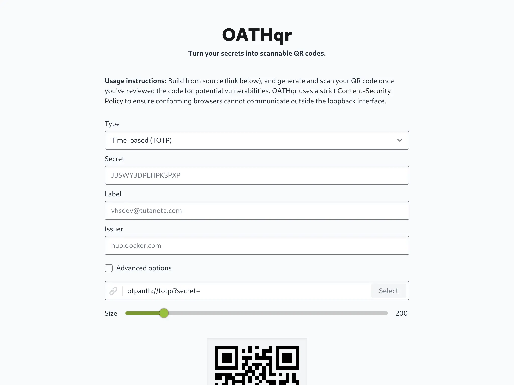
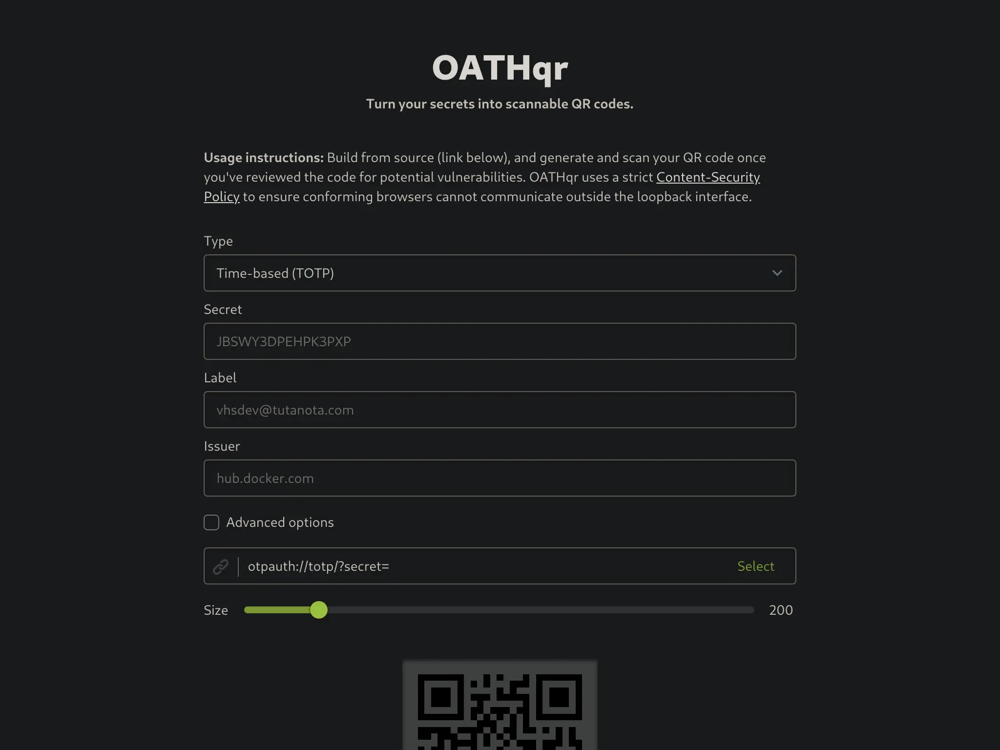

# OATHqr

> Turn your secrets into scannable QR codes.

OATHqr helps you create security credentials for use with 2FA/MFA and other [OATH-enabled](https://openauthentication.org) apps. Use it to generate scannable QR codes for one-time password authenticator apps such as [Aegis](https://getaegis.app/) or [YubiKey](https://docs.yubico.com/yesdk/index.html). Or skip the QR code altogether and paste the formatted `otpauth` URI it creates directly into [OpenPGP](https://www.openpgp.org/software/)-activated password managers such as the remarkable [Pass](https://www.passwordstore.org/) standard unix password manager.

## Highlights

- Makes no external requests and runs offline-first.
- Informs users when they are using a trusted origin.
- Installable to mobile device home screens.
- Defaults browser to strict Content-Security Policy.
- Proactively disables [FLoC surveillance](https://www.eff.org/deeplinks/2021/03/googles-floc-terrible-idea) in Chrome.
- Provides accessible form for more inclusive design.
- Promotes ethical software alternatives to Google.
- Adjusts color scheme based on system preference.

## Screenshots

OATHqr adapts its colors based on your current system preference:

|              Prefers Light               |              Prefers Dark               |
| :--------------------------------------: | :-------------------------------------: |
|  |  |

## Demo

View the [online demo](https://oathqr.vercel.app) to test it out and see how it works.

## Developing

Once you've cloned the project and installed development dependencies with `pnpm install`, start a development server:

```bash
pnpm dev

# or start the server and open the app in a new browser tab
pnpm dev -- --open
```

## Building

To create a production version of your app:

```bash
pnpm build
```

You can preview the production build with `pnpm preview`.

> To deploy your app, you may need to install an [adapter](https://kit.svelte.dev/docs#adapters) for your target environment.

## Rights

OATHqr - Turn your secrets into scannable QR Codes.<br>
Copyright (C) 2022 VHS \<vhsdev@tutanota.com\> (https://vhs.codeberg.page)

OATHqr is made available under the AGPL-3.0-or-later license. See the file COPYING in the source for the complete license text. To purchase a commercial license for the purpose of whitelabeling this application within your organization please [contact the author](https://vhs.codeberg.page/contact).
